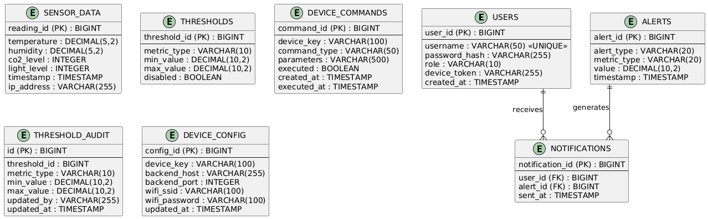
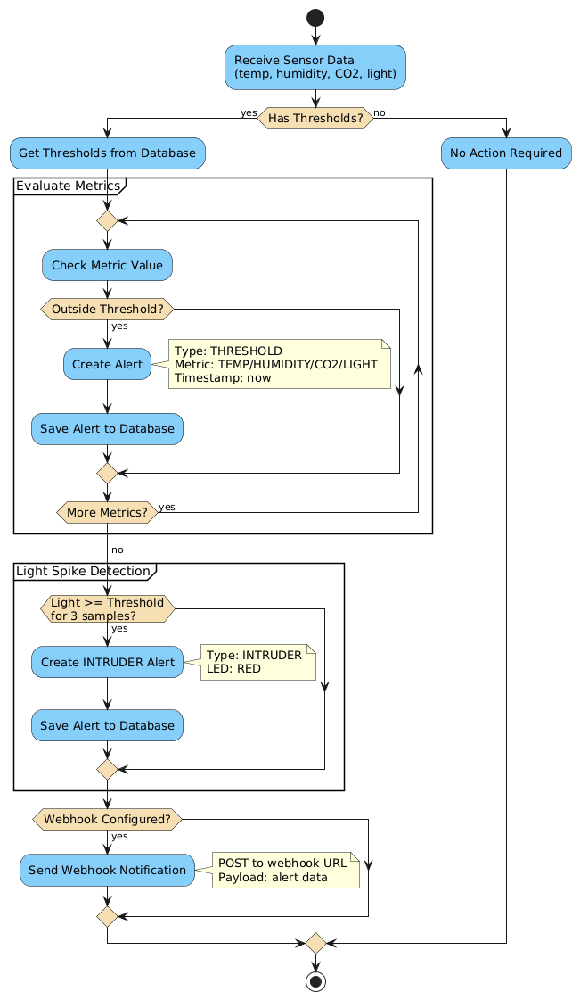
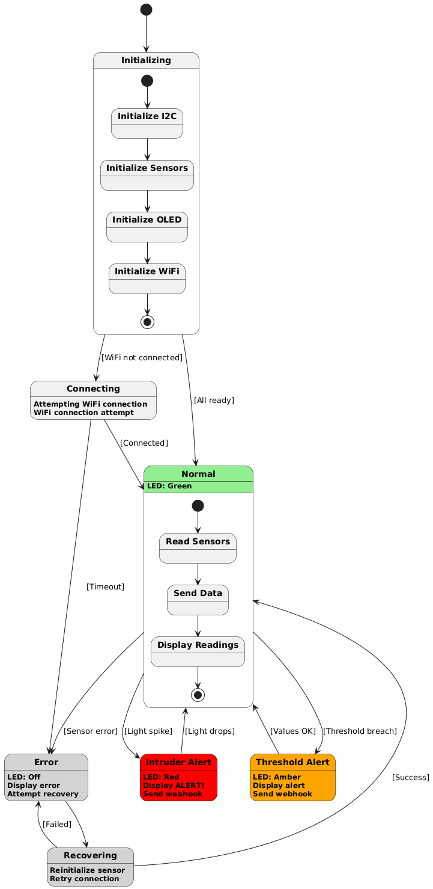

# EcoGuard 

Environmental monitoring system with ESP32, Spring Boot backend, Vue.js frontend, and Android mobile app

## Installation

Clone the repository:

```bash
git clone https://github.com/erdemonal/EcoGuard.git
cd EcoGuard
```

## Requirements

### Backend
- Java 17 or higher
- Gradle (included via wrapper)

### Frontend
- Node.js 18 or higher
- npm or yarn

### Mobile
- Android Studio (latest version)
- Android SDK (API level 24+)
- Kotlin
- Firebase project with Cloud Messaging enabled
- `google-services.json` file (download from Firebase Console)

### Embedded
- ESP32 microcontroller
- MicroPython firmware
- SCD41 sensor (Temperature, Humidity, CO₂)
- Light sensor (photoresistor)
- OLED display (I2C)
- Hardware components (resistors, wires, breadboard)

See `embedded/README.md` for detailed hardware setup and circuit diagram.

## Setup

### Backend

```bash
cd backend
./gradlew bootRun
```

Backend runs on `http://localhost:8080`

**First run:**
- Database will be automatically created at `backend/data/ecoguard-db.mv.db`
- Default admin and user accounts are created automatically

### Frontend

```bash
cd frontend
npm install
npm run dev
```

Frontend runs on `http://localhost:5173`

When serving the built frontend (e.g., `npm run build` + `npm run preview` or hosting the `dist/` output behind another server), expose the backend URL via an environment variable:

```bash
# inside frontend/
VITE_API_BASE=http://localhost:8080 npm run preview
```

You can also create a `.env.local` file with `VITE_API_BASE=http://<backend-host>:8080`.

### Mobile

1. **Firebase Setup:**
   - Create a Firebase project at https://console.firebase.google.com/
   - Enable Cloud Messaging (FCM)
   - Download `google-services.json` and place it in `mobile/app/`

2. **Build and Run:**
   ```bash
   cd mobile
   # Open in Android Studio or use Gradle:
   ./gradlew assembleDebug
   ```

3. **Configuration:**
   - For emulator: Backend URL is already set to `http://10.0.2.2:8080/`
   - For real device: Update `BASE_URL` in `mobile/app/src/main/java/com/ecoguard/mobile/network/RetrofitClient.kt` to your backend's LAN IP (e.g., `http://192.168.x.x:8080/`)

4. **First Run:**
   - Login with default credentials (see Default Credentials section)
   - Grant notification permissions when prompted
   - Device token will be automatically sent to backend for push notifications

### Embedded

See `embedded/README.md` for detailed setup instructions.

**Quick setup:**
1. Upload `main.py` and driver files to ESP32
2. Configure WiFi credentials in `main.py`
3. Set `BACKEND_IP` to your backend server IP
4. Run `main.py`

## Default Credentials

- **Admin**: `admin` / `admin`
- **User**: `user` / `user`

## Project Structure

```
EcoGuard/
├── backend/          # Spring Boot API
├── frontend/         # Vue.js Dashboard
├── mobile/           # Android mobile app (Kotlin)
└── embedded/         # ESP32 MicroPython code
```

## API Endpoints

### Authentication
- `POST /api/auth/login` - User login
- `PUT /api/auth/device-token` - Update device token (mobile)

### Device (X-Device-Key)
- `POST /api/device/sensor-data` - Send sensor data
- `GET /api/device/thresholds` - Get thresholds
- `GET /api/device/commands` - Get pending commands
- `PUT /api/device/commands/{id}/ack` - Acknowledge command

### User (Bearer Token)
- `GET /api/user/sensor-data` - Get all sensor data
- `GET /api/user/sensor-data/latest` - Get latest reading
- `GET /api/user/sensor-data/range` - Get data range
- `GET /api/user/thresholds` - Get thresholds (read-only)
- `GET /api/user/thresholds/by-metric/{metricType}` - Get threshold by metric
- `GET /api/user/alerts` - Get all alerts
- `GET /api/user/alerts/{id}` - Get alert by ID

### Admin (Bearer Token)
- `GET /api/admin/sensor-data` - Get all sensor data
- `GET /api/admin/sensor-data/latest` - Get latest reading
- `GET /api/admin/sensor-data/range` - Get data range
- `GET /api/admin/thresholds` - Get all thresholds
- `GET /api/admin/thresholds/{id}` - Get threshold by ID
- `GET /api/admin/thresholds/by-metric/{metricType}` - Get threshold by metric
- `PUT /api/admin/thresholds/{id}` - Update threshold
- `DELETE /api/admin/thresholds/{id}` - Delete threshold
- `GET /api/admin/alerts` - Get all alerts
- `GET /api/admin/alerts/{id}` - Get alert by ID
- `POST /api/admin/device/commands` - Send device command
- `GET /api/admin/device/commands` - Get all commands
- `GET /api/admin/device/commands/by-device/{deviceKey}` - Get commands by device

## Database

H2 database: `backend/data/ecoguard-db.mv.db`



Access H2 Console: `http://localhost:8080/h2-console`
- JDBC URL: `jdbc:h2:file:./data/ecoguard-db`
- Username: `sa`
- Password: (empty)

## Diagrams 

**Activity Diagram**  


**State Machine Diagram**  


**Database Schema**  


**Deployment Diagram**  


**Sequence Diagram **  


## Documentation approach 
This README is organized with a Diátaxis mindset (tutorials, how-to, reference, explanations). See https://diataxis.fr/ for the philosophy.

Made with ❤️ in Saint-Étienne
