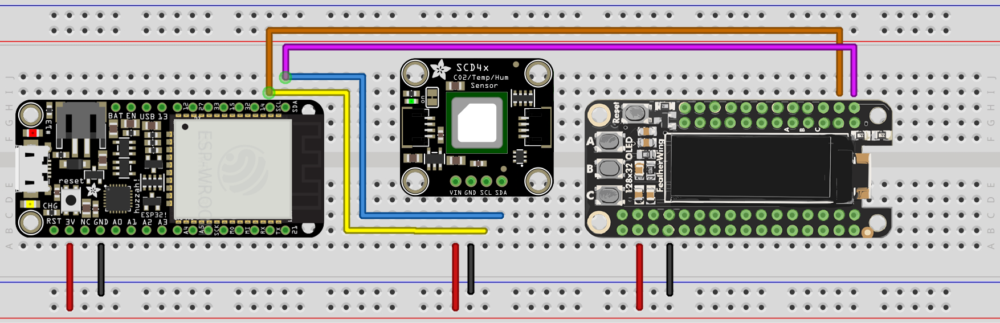

# EcoGuard — Embedded System

This directory contains the **embedded system** part of the **EcoGuard** project.  
EcoGuard is an IoT-based environmental monitoring system that collects air quality data and shares it with a remote server.  

The embedded device is powered by an **ESP32** microcontroller and uses an **SCD41** sensor to measure **temperature**, **humidity**, and **CO2 levels**.  
The readings are shown on an **OLED display** and transmitted to a remote database. 

---

## Circuit Overview

The ESP32 communicates with the **SCD41 sensor** and **OLED display** using the **I2C protocol**.  

For more, check the `diagrams/` folder.

## Driver Usage 

Copy the files from the `drivers/` folder and upload them to the device with the `main.py` file.
